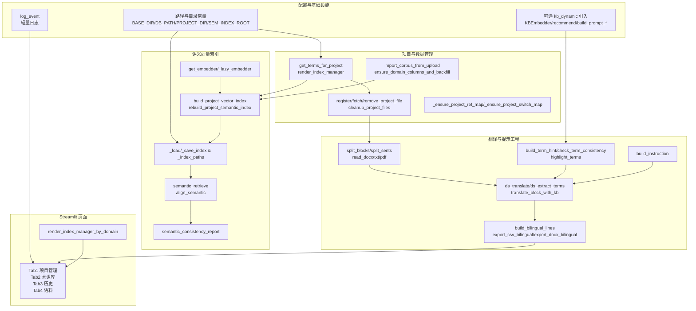

# 1127.py 逻辑架构图

本图概述 Streamlit 应用 `1127.py` 的核心组件及其依赖关系，按功能层次划分：配置与日志、项目与文件管理、向量语义索引、翻译流水线，以及 UI 选项卡。



- **配置与基础设施**：定义基础路径、日志、可选的动态术语/向量组件，为后续模块提供依赖。【F:1127.py†L24-L120】
- **数据层**：管理项目、文件、领域/项目映射以及语料导入，支撑索引与翻译上下文构建。【F:1127.py†L214-L706】【F:1127.py†L2641-L2761】
- **语义索引**：封装向量生成、索引读写、召回与一致性报告，按领域与项目分级存储。【F:1127.py†L830-L1671】
- **翻译流水线**：涵盖文档解析、分段、术语提示与检查、指令生成、DeepSeek 请求和双语导出。【F:1127.py†L870-L2627】
- **UI 视图**：Streamlit 选项卡与索引管理面板，将上述能力组合为可交互界面。【F:1127.py†L2807-L3576】
```
